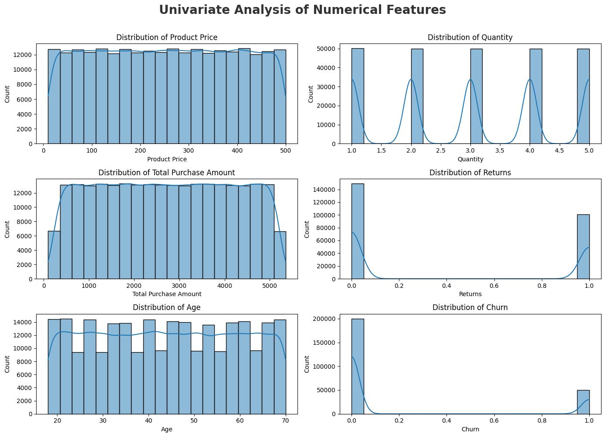
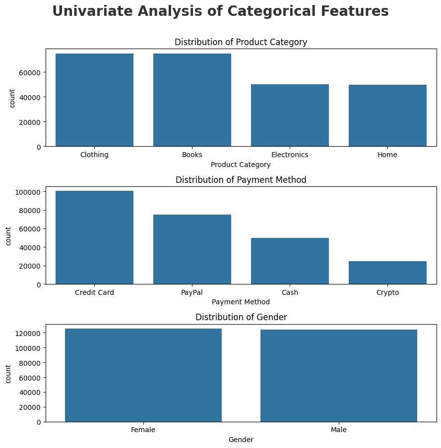
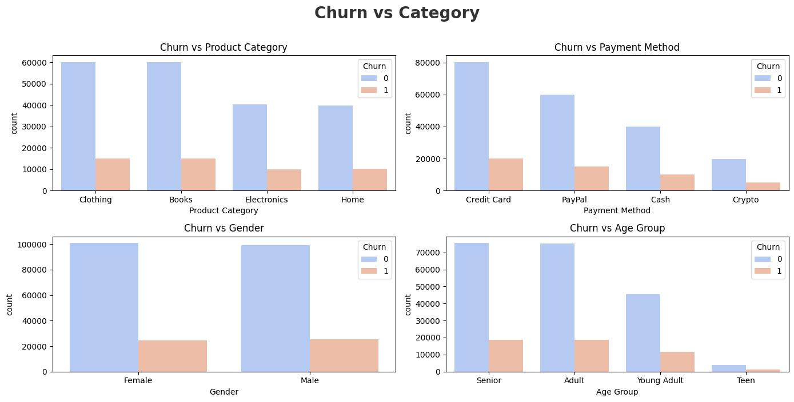
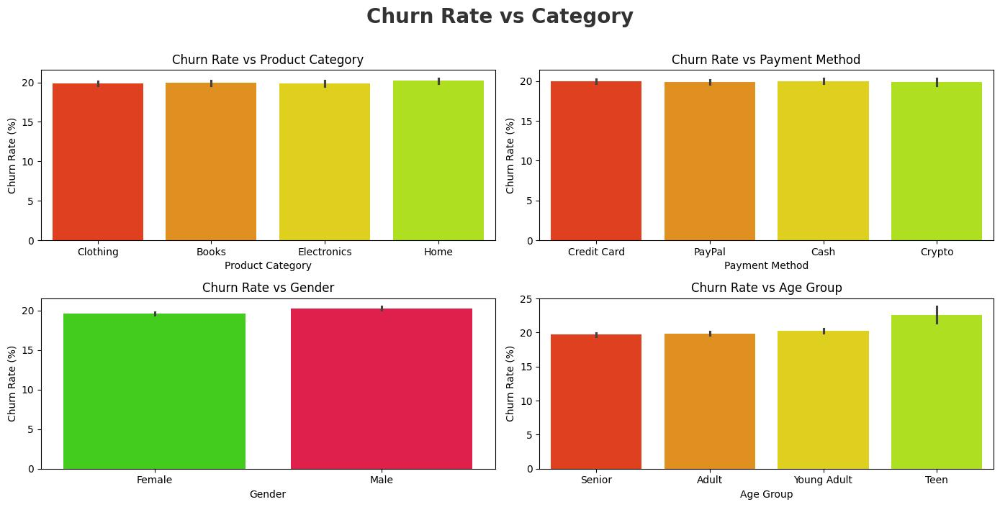
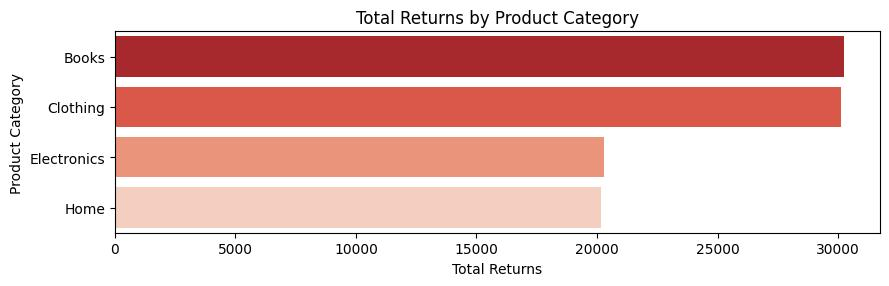
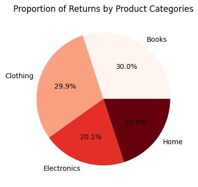
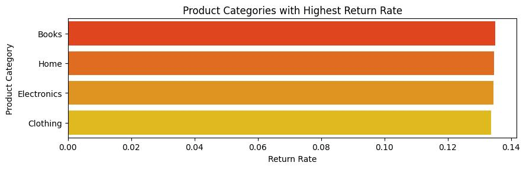
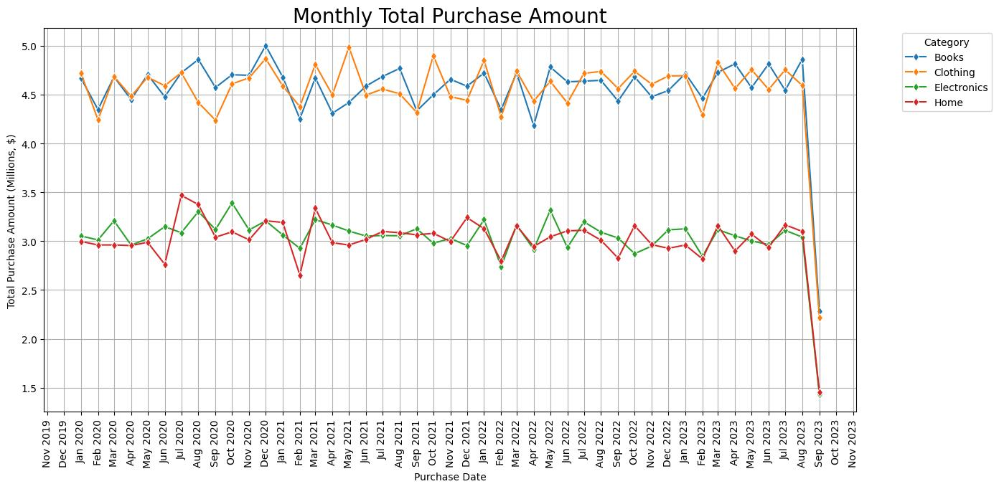
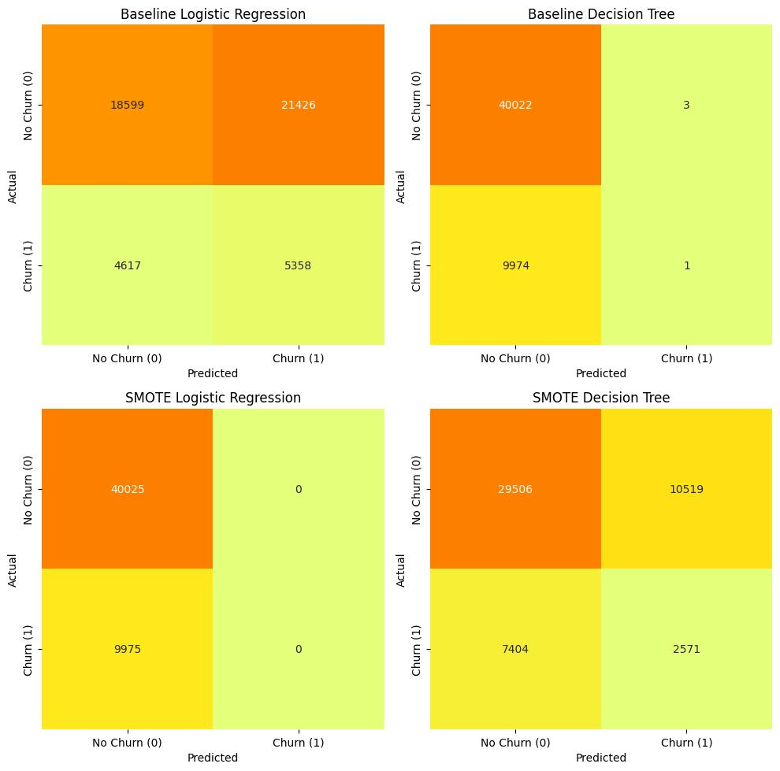

# E-commerce-Customer-Behavior
This project analyzes customer purchase transactions and builds predictive models for churn classification.

## Objectives
1. Perform data cleaning and preprocessing  
2. Explore key insights (trends, correlations, distributions)  
3. Build predictive models (Logistic Regression and Decision Tree (baseline and SMOTE))  
4. Evaluate model performance  

## Dataset
- Source: [Kaggle - E-commerce Customer Bahavior](https://www.kaggle.com/datasets/shriyashjagtap/e-commerce-customer-for-behavior-analysis)  
- Size: 250,000 records  
- Features: Purchase Date, Product Category, Product Price, Quantity, Total Purchase Amount, Payment Method, Returns, Customer Name, Age, Gender, Churn (target variable)

## Tools
- Python (pandas, numpy, matplotlib, seaborn, plotly, scikit-learn, imbalanced-learn)  
- Jupyter Notebook  
- Tableau (for dashboard visualization)  

## 📊 Exploratory Data Analysis (EDA)

### 1. Univariate Analysis
- **Histogram of numerical features**
  ```python
  num_columns=df.select_dtypes(include=np.number).columns.to_list()
  plt.figure(figsize=(14,10))
  plt.suptitle("Univariate Analysis of Numerical Features",fontsize=20,fontweight='bold',alpha=0.8,y=1.)
  for i, col in enumerate (num_columns):
    plt.subplot(3,2,i+1)
    sns.histplot(df[col], bins=20, kde=True)
    plt.title(f"Distribution of {col}")
  plt.tight_layout(rect=[0, 0, 1, 0.99])
  plt.savefig("01_Univariate_Analysis_of_Numerical_Features.jpg", bbox_inches='tight')
  plt.show()
  ```
  
- **Bar plot of categorical features**
  ```python
  cat_columns=['Product Category','Payment Method', 'Gender']
  plt.figure(figsize=(9,9))
  plt.suptitle("Univariate Analysis of Categorical Features",fontsize=20,fontweight='bold',alpha=0.8,y=1.)
  for i, col in enumerate (cat_columns):
    plt.subplot(3,1,i+1)
    sns.countplot(x=df[col], order=df[col].value_counts().index)
    plt.title(f"Distribution of {col}")
  plt.tight_layout(rect=[0, 0, 1, 0.99])
  plt.savefig("02_Univariate_Analysis_of_Categorical_Features.jpg", bbox_inches='tight')
  plt.show()
  ```
  

### 2. Multivariate Analysis
- **Correlation heatmap** of numerical features
  ```python
  plt.figure(figsize=(12,5))
  sns.heatmap(df.corr(numeric_only=True), annot=True, cmap="flare")
  plt.title("Multivariate Analysis (Correlation of Numerical Features)")
  plt.savefig("03_Multivariate_Analysis_(Correlation_of_Numerical_Features).jpg", bbox_inches='tight')
  plt.show()
  ```
  .jpg)
- **Total Purchase Amount by Age**
  ```python
  if 'Age' in df.columns:
    plt.figure(figsize=(14,7))
    sns.boxplot(x='Age', y='Total Purchase Amount', data=df, palette='Paired')
    plt.title("Total Purchase Amount by Age Group")
    plt.tight_layout(rect=[0, 0, 1, 0.99])
    plt.savefig("04_Total_Purchase_Amount_by_Age_(boxplot).jpg", bbox_inches='tight')
    plt.show()
  ```
  .jpg)
- **Churn vs categorical features**
  ```python
  df["Age Group"] = pd.cut(df["Age"], bins=[0,18,30,50,80], labels=["Teen","Young Adult","Adult","Senior"])
  churn_columns=['Product Category','Payment Method', 'Gender', 'Age Group']
  plt.figure(figsize=(14,7))
  plt.suptitle("Churn vs Category",fontsize=20,fontweight='bold',alpha=0.8,y=1.)
  for i, col in enumerate (churn_columns):
    plt.subplot(2,2,i+1)
    sns.countplot(data=df, x=col, order=df[col].value_counts().index, hue='Churn', palette='coolwarm')
    plt.title(f"Churn vs {col}")
  plt.tight_layout(rect=[0, 0, 1, 0.99])
  plt.savefig("05_Churn_vs_Category.jpg", bbox_inches='tight')
  plt.show()
  ```
  

### 3. Churn & Returns Analysis
- **Churn rate** (percentage of customers who churned)
  ```python
  churn_rate_columns=['Product Category','Payment Method', 'Gender', 'Age Group']
  plt.figure(figsize=(14,7))
  plt.suptitle("Churn Rate vs Category",fontsize=20,fontweight='bold',alpha=0.8,y=1.)
  for i, col in enumerate (churn_rate_columns):
    plt.subplot(2,2,i+1)
    sns.barplot(data=df, x=col, y="Churn", order=df[col].value_counts().index, estimator=lambda x:np.mean(x)*100, palette='prism')
    plt.ylabel('Churn Rate (%)')
    plt.title(f"Churn Rate vs {col}")
  plt.tight_layout(rect=[0, 0, 1, 0.99])
  plt.savefig("06_Churn_Rate_vs_Category.jpg", bbox_inches='tight')
  plt.show()
  ```
  
- **Total returns**
  ```python
  plt.figure(figsize=(9,3))
  sns.barplot(x=returns_by_category.values, y=returns_by_category.index, palette="Reds_r")
  plt.title("Total Returns by Product Category")
  plt.xlabel("Total Returns")
  plt.ylabel("Product Category")
  plt.tight_layout(rect=[0, 0, 1, 0.99])
  plt.savefig("07_Total_Returns.jpg", bbox_inches='tight')
  plt.show()
  ```
  
- **Proportion of returns**
  ```python
  plt.figure(figsize=(4,4))
  returns_by_category.plot(kind="pie", autopct='%1.1f%%', colormap="Reds")
  plt.ylabel("")
  plt.title("Proportion of Returns by Product Categories")
  plt.tight_layout(rect=[0, 0, 1, 0.99])
  plt.savefig("08_Proportion_of_Returns.jpg", bbox_inches='tight')
  plt.show()
  ```
  
- **Return rate per product category**
  ```python
  #Calculate Total Sold & Return by Categories
  category_stats = df.groupby("Product Category").agg(
    total_sold=("Quantity", "sum"),
    total_returns=("Returns", "sum")
  )
  
  # Add column return rate
  category_stats["return_rate"] = category_stats["total_returns"] / category_stats["total_sold"]
  
  # Sort by return rate
  category_stats_sorted = category_stats.sort_values("return_rate", ascending=False)
  print(category_stats_sorted)
  
  # Highest Return Rate Visualization 
  plt.figure(figsize=(9,3))
  sns.barplot(x="return_rate", y=category_stats_sorted.index, data=category_stats_sorted, palette="autumn")
  plt.title("Product Categories with Highest Return Rate")
  plt.xlabel("Return Rate")
  plt.ylabel("Product Category")
  plt.tight_layout(rect=[0, 0, 1, 0.99])
  plt.savefig("09_Return_Rate.jpg", bbox_inches='tight')
  plt.show()
  ```
  

### 4. Trend Analysis
- **Monthly Total Purchase Amount** (time series trend of spending)
  ```python
  #Group by Purchase Date (monthly) and Product Category, then sum Total Purchase Amount
  group_trend = df.groupby([
    df['Purchase Date'].dt.to_period('M').dt.to_timestamp(),  # group by month
    'Product Category'
  ])['Total Purchase Amount'].sum().reset_index()
  
  
  #Convert sales to thousands
  group_trend.loc[:, 'Total Purchase Amount (Millions)'] = group_trend['Total Purchase Amount'] / 1e6
  
  # Plot
  plt.figure(figsize=(14, 7))
  sns.lineplot(data=group_trend, x='Purchase Date', y='Total Purchase Amount (Millions)', hue='Product Category', marker="d")
  plt.title('Monthly Total Purchase Amount', fontsize=20)
  plt.xlabel('Purchase Date')
  plt.ylabel('Total Purchase Amount (Millions, $)')
  ax = plt.gca()
  ax.xaxis.set_major_locator(mdates.MonthLocator(interval=1))  # every 1 month
  ax.xaxis.set_major_formatter(mdates.DateFormatter('%b %Y'))  # format as Jan 2015
  plt.xticks(rotation=90)
  plt.legend(title='Category', bbox_to_anchor=(1.05, 1), loc='upper left')
  plt.tight_layout(rect=[0, 0, 1, 0.99])
  plt.grid(True)
  plt.savefig("10_Monthly_Total_Purchase_Amount.jpg", bbox_inches='tight')
  plt.show()
  ```
  

### 5. Customer-Product Analysis
- **Top 10 Total Purchase by Customer-Product**
  ```python
  top_number = (df['Customer Name']+' - '+df['Product Category']).value_counts().head(10).reset_index()
  top_number.columns = ['Customer-Product', 'Total Purchase']
  
  max_val = top_number['Total Purchase'].max()
  
  fig = px.bar(
    top_number,
    x='Customer-Product',
    y='Total Purchase',
    title='Top 10 Total Purchase by Customer Product',
    text='Total Purchase'
  )
  
  fig.update_traces(textposition='outside')
  
  fig.update_layout(
    yaxis=dict(range=[0, max_val * 1.2]),
    xaxis_tickangle=-45
  )
  
  fig.show()
  fig.write_html("11_Top_10_Total_Purchase_by_Customer-Product.html")
  ```
  
- **Top 10 High Value Customer-Product**
  ```python
  df['Customer Product'] = df['Customer Name']+' - '+df['Product Category']
  
  # Group by Customer Product and sum the Total Purchase Amount
  top_customer_product = (
    df.groupby('Customer Product')['Total Purchase Amount']
    .sum()
    .sort_values(ascending=False)
    .head(10)
    .reset_index()
  )
  top_customer_product['Total Purchase Amount (Thousands, $)'] = (top_customer_product['Total Purchase Amount'] / 1e3).round(1)
  
  # Get max total purchase amount value to set y-axis limit
  max_val = top_customer_product['Total Purchase Amount (Thousands, $)'].max()
  
  # Create the bar chart
  fig = px.bar(
    top_customer_product,
    x='Customer Product',
    y='Total Purchase Amount (Thousands, $)',
    title='Top 10 High Valuer Customer-Product',
    text='Total Purchase Amount (Thousands, $)'
  )
  
  fig.update_traces(textposition='outside')
  
  fig.update_layout(
    yaxis=dict(range=[0, max_val * 1.2]),  # 20% headroom
    yaxis_title='Total Purchase Amount (Thousands, $)',
    xaxis_tickangle=-45,
  )
  
  fig.show()
  fig.write_html("12_Top 10_High_Valuer_Customer-Product.html")
  ```
  

## 🤖 Predictive Modeling

### Baseline Models
- Logistic Regression
  ```python
  logreg = LogisticRegression(max_iter=1000)
  logreg.fit(X_train_scaled, y_train)
  results.append(evaluate("Baseline LogReg", logreg, X_test_scaled, y_test))
  ```
- Decision Tree
  ```python
  dtree = DecisionTreeClassifier(max_depth=5, random_state=42)
  dtree.fit(X_train, y_train)
  results.append(evaluate("Baseline DecisionTree", dtree, X_test, y_test))
  ```

### With SMOTE (Handling Imbalanced Churn)
- Logistic Regression + SMOTE
  ```python
  logreg_smote = LogisticRegression(max_iter=1000)
  logreg_smote.fit(X_train_res_scaled, y_train_res)
  results.append(evaluate("SMOTE LogReg", logreg_smote, X_test_scaled, y_test))
  ```
- Decision Tree + SMOTE
  ```python
  dtree_smote = DecisionTreeClassifier(max_depth=5, random_state=42)
  dtree_smote.fit(X_train_res, y_train_res)
  results.append(evaluate("SMOTE DecisionTree", dtree_smote, X_test, y_test))
  ```
- Evaluation metrics: Accuracy, Precision, Recall, F1-score [Outputs](output/model/)
- Plot Confusion
  

## Dashboard
👉 Tableau Dashboard: [View Here](https://public.tableau.com/views/E-commerceCustomerBehavior_17575174020140/Dashboard1?:language=en-US&:sid=&:redirect=auth&:display_count=n&:origin=viz_share_link)

## 🚀 Key Insights (Examples)
- Older customers (>30 years) tend to have higher purchase frequency but lower churn.  
- Returns are more frequent in certain product categories (e.g., books, clothing).  
- Logistic Regression with SMOTE improved recall significantly compared to baseline.  

---

## 📌 Next Steps
- Experiment with advanced models (Random Forest, XGBoost).  
- Build dashboard for real-time monitoring of churn.  
- Deploy churn prediction API using Flask/Streamlit.
